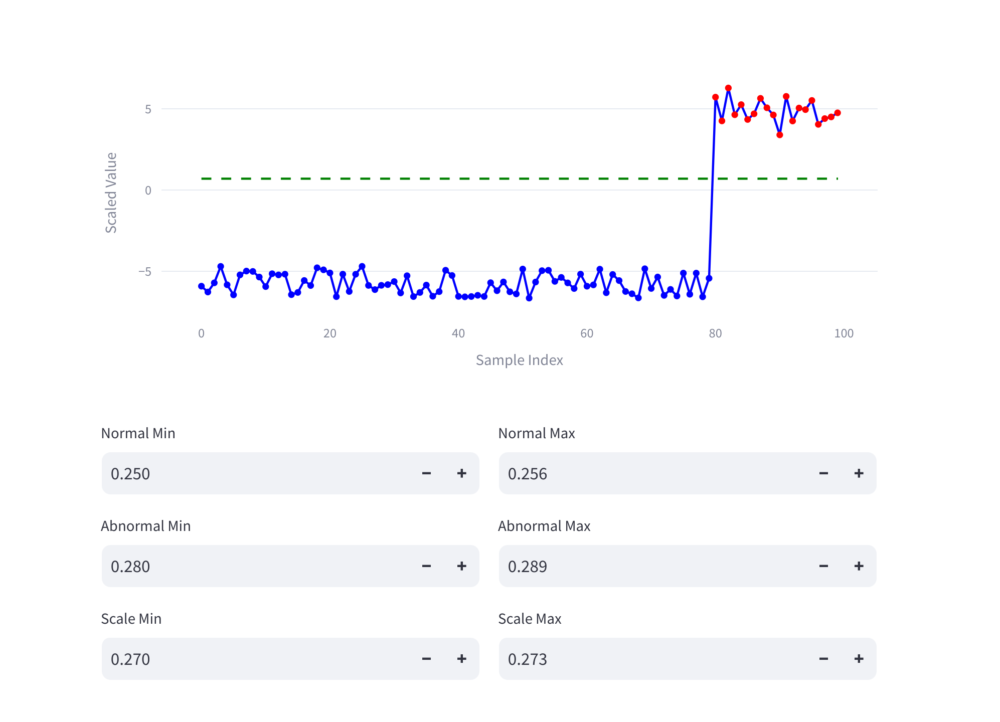

# **정상 및 비정상 데이터 시각화 및 스케일링 앱**



## **개요**
이 Streamlit 앱은 정상 상황과 비정상 상황에서의 데이터를 시각화하고 **스케일링**할 수 있도록 구성되어 있습니다.(MACS보고 노가다하기 귀찮아서 만들었다)
사용자가 입력한 **범위**에 따라 데이터를 랜덤 생성하며, 정상 데이터와 비정상 데이터를 구분하여 시각적으로 확인할 수 있습니다.
또한 **Min-Max 스케일링** 기능을 제공하며, 그래프에 기준 임계선(0.7)을 추가하여 분석하기 쉽게 설계되었습니다.

## Tip
min max 의 차이는 0.03을 고정적으로 가져가는걸 추천한다.
max - min = 0.03 은 고정적으로 나오도록 min,max를 조정하며 최적의 임계값을 찾는게 베스트

값 입력하고 엔터누르세요 바로 반영이 안될 수 있습니다.(session state를 다시 넣는 형태여서 2번클릭하거나 엔터눌러야함)

---

## **기능**
1. **데이터 생성**  
   - **정상 데이터**: 지정된 범위 내에서 생성되며 **80개 샘플**로 고정
   - **비정상 데이터**: 별도의 범위 내에서 생성되며 **20개 샘플**로 설정
   - 총 **100개의 샘플**이 X축의 인덱스를 기준으로 표시

2. **Min-Max 스케일링**  
   - 입력된 **스케일링 범위**를 기준으로 데이터를 정규화하여 시각화

3. **시각화**  
   - **스케일링된 데이터**와 **원본 데이터**를 각각의 그래프에 표시
   - **정상 데이터**는 **파란색**, **비정상 데이터**는 **빨간색**으로 구분
   - 임계선(0.7)은 **녹색 점선**으로 그래프에 추가되어 기준값을 한눈에 확인

4. **사용자 입력**  
   - **정상 데이터 범위**: Normal Min / Normal Max  
   - **비정상 데이터 범위**: Abnormal Min / Abnormal Max  
   - **스케일링 범위**: Scale Min / Scale Max  

---

## **설치 방법**
1. 필요한 패키지 설치:
   ```bash
   pip install streamlit numpy plotly
   ```

2. 앱 실행:
   ```bash
   streamlit run app.py
   ```

---

## **사용법**
### **입력 항목**  
1. **Normal Min / Normal Max**: 정상 데이터가 생성될 최소 및 최대값을 입력
2. **Abnormal Min / Abnormal Max**: 비정상 데이터가 생성될 최소 및 최대값을 입력  
3. **Scale Min / Scale Max**: 스케일링된 값의 범위를 조정

### **출력 그래프**  
1. **Min-Max Scaled Data**:  
   - 스케일링된 데이터가 표시되며, **임계선(0.7)**이 함께 나옴
   - 파란색: 정상 데이터 (80개 샘플)  
   - 빨간색: 비정상 데이터 (20개 샘플)  

2. **Original Data Distribution**:  
   - 원본 데이터가 그대로 표시되며, 정상 및 비정상 데이터를 시각적으로 구분  

---

## **코드 설명**
- **`generate_data` 함수**:  
  입력된 정상 및 비정상 범위에 따라 랜덤 데이터를 생성  

- **`min_max_scaling` 함수**:  
  Min-Max 스케일링을 적용하여 데이터를 정규화

- **그래프 시각화**:  
   - Plotly를 사용해 두 개의 그래프를 출력 
     - **상단 그래프**: 스케일링된 데이터  
     - **하단 그래프**: 원본 데이터  

- **세션 상태**:  
  사용자의 이전 입력값을 저장하여 새로고침 시에도 유지

---

